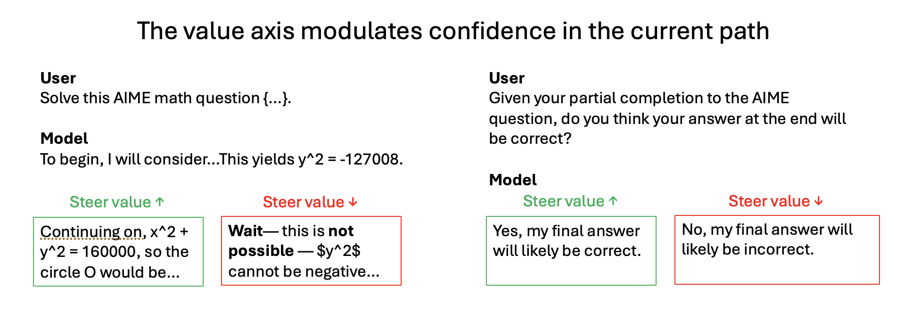

# The Value Axis: Language Models Encode Whether They're on the Right Track

Nick Jiang, Isaac Kauvar, Jack Lindsey

<p align="center">
  
</p>

**We identify a "value" axis that measures whether the model is on the right track across domains.** On AIME math problems, steering a Qwen3-8B rollout along this axis causally modulates task confidence. *Left:* Steering toward high value (green) makes the model persist with its current approach, while steering toward low value (red) induces backtracking. *Right:* When the model is asked whether its partial completion will reach the correct answer, high-value steering elicits an affirmative answer and low-value steering a negative one. This same axis behaves consistently across coding, preference-learning, and the various in-the-wild settings we study.

## Setup

```bash
uv sync
source .venv/bin/activate
```

## Reproducing experiments

Please see the `experiments/` folder for scripts to reproduce the results in the paper.